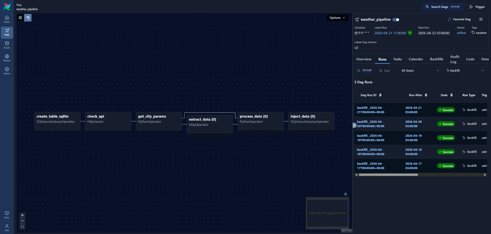

# Building Automated Data Pipelines HW1. Airflow basics.

- [x] Версія API openweathermap змінена на 3.0
- [x] Додано вологість, хмарність та швидкість вітру
- [x] Виправлено виконання DAG для історичних даних
- [x] Додана обробка погодних даних для інших міст


## 1. Створюємо віртуальне оточення та активовуєм його
```bash
python3 -m venv .venv
source .venv/bin/activate
```

## 2. Встановлюємо залежності
```bash
pip install -r requirements.txt
```

## 3. Запускаємо airflow
```bash
AIRFLOW_HOME="$(pwd)/airflow" \
AIRFLOW__CORE__DAGS_FOLDER="$(pwd)/dags" \
AIRFLOW__CORE__LOAD_EXAMPLES="False" \
airflow standalone
```

## 4. Конфігуруємо DAG

### 4.1 Створюємо з'єднання до sqlite3 бази даних
1. Переходимо на сторінку керування з'єднаннями - http://localhost:8080/connections
2. Створюємо sqlite-з'єднання:
    - Connection ID: `weather_conn`
    - Connection Type: `Sqlite`
    - Host: `/path/to/weather.db`

### 4.2 Додаємо API-ключ для weather API
1. Створюємо акаунт та API-ключ на openweathermap.org (вимагає підписки на One Call 3.0)
2. Переходимо на http://localhost:8080/variables
3. Створюємо змінну `WEATHER_API_KEY` зі значенням створеного API-ключа

### 4.3 Створюємо з'єднання для weather API
1. Переходимо на сторінку керування з'єднаннями - http://localhost:8080/connections
2. Створюємо http-з'єдання
- Connection ID: `weather_conn_http`
- Connection Type: `HTTP`
- Host: https://api.openweathermap.org/

# 5. Запускаємо DAG з бекфілом за останні 5 днів
## 5.1 Результат виконання:


## 5.2 Дані в БД:
1. Підключаємось до БД:
    ```bash
    sqlite3 weather.db
    ```
2. Вибираємо дані
    ```sql
    sqlite> SELECT 
        strftime('%d/%m/%Y %H:%M:%S', datetime(timestamp, 'unixepoch')), 
        city, 
        temp, 
        humidity, 
        clouds, 
        wind_speed 
    FROM measures
    ORDER BY timestamp desc, city;

    21/04/2026 00:00:00|Kharkiv|276.88|65.0|5.0|0.7
    21/04/2026 00:00:00|Kyiv|276.63|67.0|1.0|1.95
    21/04/2026 00:00:00|Lviv|275.73|93.0|100.0|2.44
    21/04/2026 00:00:00|Odesa|280.07|89.0|100.0|7.2
    21/04/2026 00:00:00|Zhmerynka|274.35|90.0|97.0|3.06
    20/04/2026 00:00:00|Kharkiv|276.78|75.0|5.0|3.67
    20/04/2026 00:00:00|Kyiv|276.67|75.0|43.0|1.52
    20/04/2026 00:00:00|Lviv|281.87|74.0|100.0|2.33
    20/04/2026 00:00:00|Odesa|282.6|66.0|96.0|4.48
    20/04/2026 00:00:00|Zhmerynka|278.96|69.0|93.0|3.15
    19/04/2026 00:00:00|Kharkiv|282.05|80.0|94.0|2.77
    19/04/2026 00:00:00|Kyiv|280.56|86.0|2.0|0.45
    19/04/2026 00:00:00|Lviv|280.02|76.0|87.0|2.1
    19/04/2026 00:00:00|Odesa|281.32|76.0|6.0|5.27
    19/04/2026 00:00:00|Zhmerynka|277.82|92.0|5.0|3.01
    18/04/2026 00:00:00|Kharkiv|282.68|85.0|100.0|3.57
    18/04/2026 00:00:00|Kyiv|280.56|85.0|5.0|0.45
    18/04/2026 00:00:00|Lviv|277.62|85.0|60.0|2.11
    18/04/2026 00:00:00|Odesa|283.89|66.0|100.0|2.49
    18/04/2026 00:00:00|Zhmerynka|277.51|92.0|5.0|4.05
    17/04/2026 00:00:00|Kharkiv|285.07|65.0|100.0|2.4
    17/04/2026 00:00:00|Kyiv|282.46|82.0|88.0|2.32
    17/04/2026 00:00:00|Lviv|281.47|71.0|100.0|0.11
    17/04/2026 00:00:00|Odesa|281.53|64.0|10.0|3.02
    17/04/2026 00:00:00|Zhmerynka|281.65|79.0|99.0|1.9
    ```