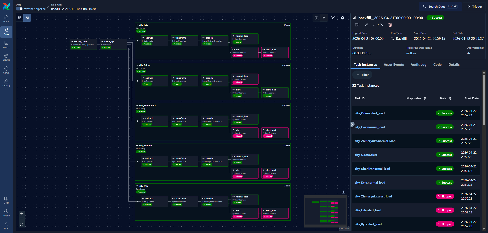
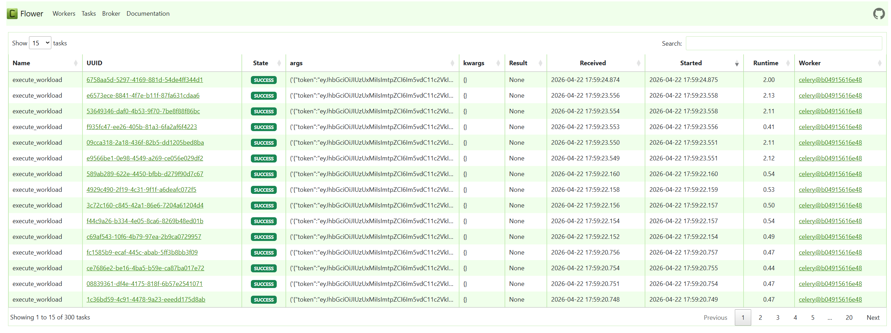

# Building Automated Data Pipelines HW2

Airflow запущено за допомогою модифікованого `docker-compose.yaml`, взятого за [посиланням](https://airflow.apache.org/docs/apache-airflow/stable/howto/docker-compose/index.html).

Виконані пункти:
- [x] extract-/transfrom-/load-таски для кожного міста обгорнуто в окрему TaskGroup
- [x] Дані між ETL-кроками передаються через XCom
- [x] Додано `BranchPythonOperator`, який викликає різні кроки на основі threshold-значення швидкості вітру (задається через змінну `WIND_SPEED_THRESHOLD_MPS`)
- [x] Airflow використовує Celery executor (налаштовано в `docker-compose.yaml`)
- [x] Додано логіку ретраїв і обробки помилок


## 1. Ініціалізуємо airflow
### 1.1 Створюємо потрібні для роботи директорії з коректними правами доступу
```bash
mkdir -p ./dags ./logs ./plugins ./config
echo -e "AIRFLOW_UID=$(id -u)" > .env
```

### 1.2 Ініціалізуємо оточення
```bash
docker compose up airflow-init
```

### 1.3 Запускаємо оточення з профілем flower
```bash
docker compose --profile flower up
```

## 2. Конфігуруємо DAG

### 2.1 Створюємо з'єднання до postgres
Для спрощення роботи - перевикористовуємо БД з метаданими airflow.

1. Переходимо на сторінку керування з'єднаннями - http://localhost:8080/connections
2. Створюємо postgres-з'єднання:
    - Connection ID: `airflow_db`
    - Connection Type: `Postgres`
    - Host: `postgres`
    - Schema: `airflow`
    - Login: `airflow`
    - Password: `airflow`
    - Port: `5432`

### 2.2 Додаємо API-ключ для weather API
1. Створюємо акаунт та API-ключ на openweathermap.org (вимагає підписки на One Call 3.0)
2. Переходимо на http://localhost:8080/variables
3. Створюємо змінну `WEATHER_API_KEY` зі значенням створеного API-ключа

### 2.3 Створюємо з'єднання для weather API
1. Переходимо на сторінку керування з'єднаннями - http://localhost:8080/connections
2. Створюємо http-з'єдання
- Connection ID: `weather_conn_http`
- Connection Type: `HTTP`
- Host: https://api.openweathermap.org/

### 2.4 (Опціонально) проставляємо threshold-значення швидкості вітру для алертів
1. Переходимо на http://localhost:8080/variables
2. Створюємо змінну `WIND_SPEED_THRESHOLD_MPS`, в якій вказуємо швидкість вітру в `м/с`, при досягненні якої повинен спрацьовувати алерт

# 3. Запускаємо DAG з бекфілом за останні 5 днів
## 3.1 Результат виконання:


## 3.2 Перевіряємо дані в БД:
1. Підключаємось до БД:
    - URL: `jdbc:postgresql://localhost:5432/airflow`
    - Credentials: `airflow/airflow`
2. Вибираємо дані
    ```postgresql
    select * 
    from weather_measures wm 
    order by timestamp desc, city;
    ```

    <details>

    <summary>Результат</summary>

    ```
    timestamp              |temp  |humidity|clouds|wind_speed|city     |
    -----------------------+------+--------+------+----------+---------+
    2026-04-22 00:00:00.000|276.92|    57.0|   8.0|      1.86|Kharkiv  |
    2026-04-22 00:00:00.000|276.57|    63.0|  83.0|      2.44|Kyiv     |
    2026-04-22 00:00:00.000|276.06|    74.0|   6.0|      1.67|Lviv     |
    2026-04-22 00:00:00.000|279.74|    54.0|   0.0|      3.35|Odesa    |
    2026-04-22 00:00:00.000|274.77|    74.0|   5.0|      2.32|Zhmerynka|
    2026-04-21 00:00:00.000|276.88|    65.0|   5.0|       0.7|Kharkiv  |
    2026-04-21 00:00:00.000|276.63|    67.0|   1.0|      1.95|Kyiv     |
    2026-04-21 00:00:00.000|275.73|    93.0| 100.0|      2.44|Lviv     |
    2026-04-21 00:00:00.000|280.07|    89.0| 100.0|       7.2|Odesa    |
    2026-04-21 00:00:00.000|274.35|    90.0|  97.0|      3.06|Zhmerynka|
    2026-04-20 00:00:00.000|276.78|    75.0|   5.0|      3.67|Kharkiv  |
    2026-04-20 00:00:00.000|277.63|    65.0|  43.0|      1.52|Kyiv     |
    2026-04-20 00:00:00.000|281.87|    74.0| 100.0|      2.33|Lviv     |
    2026-04-20 00:00:00.000| 282.6|    66.0|  96.0|      4.48|Odesa    |
    2026-04-20 00:00:00.000|278.96|    69.0|  93.0|      3.15|Zhmerynka|
    2026-04-19 00:00:00.000|282.05|    80.0|  94.0|      2.77|Kharkiv  |
    2026-04-19 00:00:00.000|279.21|    84.0|   2.0|      3.54|Kyiv     |
    2026-04-19 00:00:00.000|280.02|    76.0|  87.0|       2.1|Lviv     |
    2026-04-19 00:00:00.000|281.32|    76.0|   6.0|      5.27|Odesa    |
    2026-04-19 00:00:00.000|277.82|    92.0|   5.0|      3.01|Zhmerynka|
    2026-04-18 00:00:00.000|282.68|    85.0| 100.0|      3.57|Kharkiv  |
    2026-04-18 00:00:00.000|280.56|    85.0|   5.0|      0.45|Kyiv     |
    2026-04-18 00:00:00.000|277.62|    85.0|  60.0|      2.11|Lviv     |
    2026-04-18 00:00:00.000|283.89|    66.0| 100.0|      2.49|Odesa    |
    2026-04-18 00:00:00.000|277.51|    92.0|   5.0|      4.05|Zhmerynka|
    2026-04-17 00:00:00.000|284.46|    66.0| 100.0|      3.11|Kharkiv  |
    2026-04-17 00:00:00.000|282.78|    81.0|  84.0|      2.31|Kyiv     |
    2026-04-17 00:00:00.000|282.06|    72.0| 100.0|      0.71|Lviv     |
    2026-04-17 00:00:00.000|282.79|    67.0|  51.0|       3.4|Odesa    |
    2026-04-17 00:00:00.000|282.37|    93.0|  99.0|      3.18|Zhmerynka|
    ```

    </details>

# 4. Flower
Flower запускається шляхом указання профілю `flower` в команді `docker-compose --profile flower up`.
Скріншот роботи додатку:


---
## Додаткові команди
Оновлення DAG-ів
```bash
docker compose exec airflow-dag-processor airflow dags reserialize
```